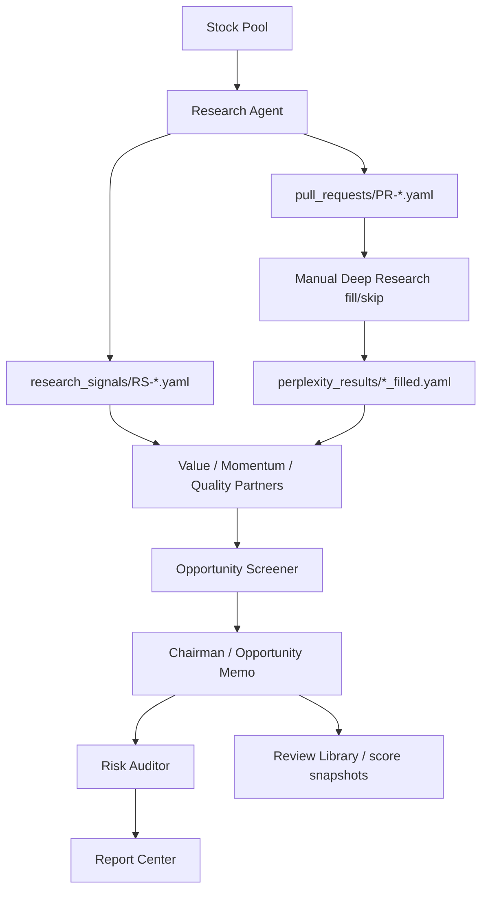

# WorldPay IC / ResearchOS Architecture

This repository is a Python/uv project for a local human-in-the-loop equity research workflow. It is not a Node app, so there is no `package.json` by design. Runtime dependencies and entry points live in `pyproject.toml`.

## Runtime Entry Points

| Entry | File / Command | Purpose |
| --- | --- | --- |
| Web workspace | `uv run python webui.py` | Starts the local FastAPI/Jinja app on `127.0.0.1:7777`. |
| Full pipeline | `uv run orchestrator run --type full` | Runs research scan, partner agents, Opportunity Memo, and Risk Audit. |
| Research scan | `uv run research-agent ...` | Converts stock-pool price movement into research signals and prompt requests. |
| Partner agents | `uv run trading-f_partner ...`, `trading-w_partner`, `trading-g_partner` | Produce method-specific views from signals and filled research. |
| Memo assembly | `uv run chairman ...` | Builds Opportunity Memo payloads and Markdown/JSON outputs. |
| Risk audit | `uv run red-team ...` | Produces rule checks, fatal-flaw review, and risk-budget boundaries. |

## Top-Level Flow



## Module Responsibilities

| Area | Paths | Responsibility |
| --- | --- | --- |
| Research upstream | `business_agents/research_agent/` | Stock-pool scan, anomaly rules, cold-start research prompts, pull-request files. |
| Partner agents | `business_agents/trading_agent.py`, `business_agents/trading_*_partner/` | Methodology-specific recommendation generation with schema validation and trial-run safety downgrades. |
| Opportunity Screener | `chairman/opportunity/` | Scoring, reason-type classification, non-consensus thesis checks, status routing, score cap policy. |
| Chairman assembly | `chairman/core/brief_assembler.py`, `chairman/output/` | Opportunity Memo assembly, decision chain, human checklist, Markdown/JSON metadata. |
| Risk Auditor | `red_team/core/`, `red_team/output/` | Rule audit, consensus-risk challenge, fatal flaw, risk-budget policy, second-review routing. |
| Orchestration | `orchestrator/core/`, `orchestrator/persistence/`, `orchestrator/cli.py` | Pipeline execution, reruns, scheduler/events, run log, learning refresh commands. |
| Learning system | `orchestrator/core/learning.py`, `schemas/decision_case.schema.yaml`, `schemas/outcome_snapshot.schema.yaml` | Decision cases, opportunity score snapshots, price outcome snapshots, stock timelines, monthly reviews. |
| Web UI | `webui.py`, `templates/` | Local task flow, Deep Research Inbox, Report Center, Stock Pool, Review Library, environment page, usage guide. |
| Reporting | `orchestrator/reporting/html_renderer.py`, `orchestrator/reporting/llm_usage.py` | HTML reading views and estimated LLM token/cost ledger. |

## Current Configuration Files

| File | Purpose | Safe Default Behavior |
| --- | --- | --- |
| `.env.example` | Local provider, data, logging, and web UI environment template. | Real `.env` is optional; local provider can run deterministic fallback paths. |
| `orchestrator/config/opportunity_scoring.yaml` | Opportunity score weights and non-consensus score cap. | Missing or invalid fields fall back to built-in safe defaults. |
| `orchestrator/config/risk_budget_policy.yaml` | Red Team risk-budget boundaries by opportunity state and verdict. | Missing or invalid fields fall back to defaults; fatal flaw always forces zero budget. |
| `orchestrator/config/scheduler.yaml` | Scheduler defaults. | CLI/Web UI can run manually without scheduler. |

## Data Contracts

| Contract | Path |
| --- | --- |
| Decision case | `schemas/decision_case.schema.yaml` |
| Outcome snapshot | `schemas/outcome_snapshot.schema.yaml` |
| Stock timeline | `schemas/stock_timeline.schema.yaml` |
| Consensus risk | `schemas/consensus_risk.schema.yaml` |
| Partner performance | `schemas/partner_performance.schema.yaml` |
| Knowledge entry | `schemas/knowledge_entry.schema.yaml` |

Generated runtime artifacts are written under `data/` and should not be edited by hand unless a task explicitly asks for data repair.

## Safety Boundaries

- The system does not auto-trade, place orders, or connect to brokers.
- The system does not automatically call Perplexity. It creates prompts and waits for manual fill/skip files.
- Opportunity states are research workflow states, not trading instructions.
- `trial_candidate` and `conviction_candidate` only mean human review or paper/human-approved tracking candidates.
- Opportunity Score is a heuristic for research triage and later evaluation, not a recommendation.
- Risk budget is a review boundary. `fatal_flaw` always outputs zero allowed budget.

## Documentation Map

| File | Use First When You Need |
| --- | --- |
| `README.md` | Product overview, quick start, current workflow, and core pages. |
| `SYSTEM_FLOW.md` | Full data flow, LLM flow, and artifact path map. |
| `ARCHITECTURE.md` | Module ownership, runtime entry points, configs, and safety boundaries. |
| `LOCAL_RUNBOOK.md` | Local installation, Web UI startup, troubleshooting, and operations commands. |
| `AGENTS.md` | Agent/Codex behavior rules when changing this repo. |
| `deployment_layer.md` | Portfolio/risk hard-rule source material used by partner methods. |
| `system_decisions_log.md` | Historical design decisions and compatibility rationale. |

## Verification

Use the project-local commands:

```bash
uv run ruff check
uv run pytest -q
```

For web-surface changes, also verify the relevant local page on `http://127.0.0.1:7777`.
