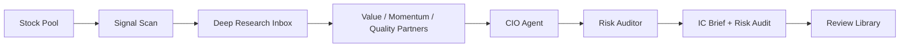

# WorldPay IC / ResearchOS

WorldPay IC is a ResearchOS workspace for equity research teams that need a repeatable Alpha Committee workflow. It turns market anomalies into research tasks, turns deep research into reusable knowledge, and turns committee reports into auditable review records.

The system does not place trades, manage portfolios, or reduce decisions to simple buy/sell calls. Its output focuses on observation, waiting conditions, missing evidence, risk triggers, and reviewable decision logic.

## What It Solves

Most AI research tools stop at a long narrative report. ResearchOS is designed around the actual operating loop after the first answer:

- Detect unusual stock signals and convert them into focused research questions.
- Route those questions through a Deep Research Inbox before final reporting.
- Compare Value, Momentum, and Quality perspectives instead of relying on one model narrative.
- Produce a polished IC Brief and a separate Risk Audit.
- Preserve decision cases, evidence gaps, and follow-up triggers for later review.

## Workflow

The main page is organized as a three-step workflow:

1. Generate research tasks from the selected stock pool.
2. Fill the Deep Research Inbox with external research findings.
3. Rerun the committee chain to generate the final IC Brief and Risk Audit.

The broader operating cycle is:



## Core Components

| Component | Role |
| --- | --- |
| Stock Pool | Defines the research universe and watchlist boundaries. |
| Signal Scan | Converts market movement into research tasks instead of instant conclusions. |
| Deep Research Inbox | Captures external research and stores it as reusable knowledge. |
| Value Partner | Focuses on valuation, cash flow, odds, and margin of safety. |
| Momentum Partner | Focuses on trend, positioning, expectation revisions, and relative strength. |
| Quality Partner | Focuses on moat, execution quality, resilience, and governance. |
| CIO Agent | Synthesizes the committee view into an IC Brief. |
| Risk Auditor | Challenges consensus narratives, evidence gaps, and execution risk. |
| Review Library | Tracks decisions, timelines, outcomes, and monthly learning reviews. |

## Reports

ResearchOS generates two reader-facing report types:

- **IC Brief**: a committee-ready report covering the anomaly, consensus explanation, non-consensus questions, agent disagreement, waiting conditions, and risk triggers.
- **Risk Audit**: an adversarial review focused on missing evidence, fragile assumptions, reverse scenarios, and follow-up checks.

Reports are rendered as polished HTML reading views. The layout prioritizes summary density first, then full evidence and appendices for auditability.

The guide page includes three sample report formats:

- NVDA anomaly research report
- BABA investment committee decision report
- AMD Risk Auditor report

## Product Surface

The web workspace is organized around user-facing product areas:

- **Task Flow**: the main research workflow from signal scan to final report.
- **Deep Research Inbox**: prompt queue, answer fill-in, and knowledge capture.
- **Report Center**: recent runs, report links, and run progress.
- **Stock Pool**: editable research universe.
- **Review Library**: decision cases, stock timelines, and learning reviews.
- **Sample Guide**: report examples and partner-agent explanations.
- **LLM API Settings**: provider and model configuration.

## Developer Setup

Install dependencies:

```bash
uv sync --extra dev --extra webui
```

Run quality checks:

```bash
uv run ruff check
uv run pytest -q
```

Start the web workspace:

```bash
uv run python webui.py
```

The server prints the local URL when it starts.

## Design Principles

- Research before recommendations.
- Disagreement before synthesis.
- Risk audit before final confidence.
- HTML reports before raw logs.
- Reviewable memory before one-off answers.
- Human decision ownership before automation.

## Boundary

ResearchOS is a research and committee-preparation system. It is not an investment adviser, trading robot, broker integration, or automated order system. Reports are for research, review, and decision preparation only, and do not constitute securities advice.
