# Worldpay77 / Nepha AI IC

Worldpay77 是一个本地运行的 AI Native 投资研究与投委会系统。它不是普通股票筛选器，也不是自动交易机器人，而是一套面向 Nepha 的私有投资公司工作台：K deep 负责提出非共识研究问题，Perplexity Deep Research 负责深度研究，F / W / G 三位 partner 独立分析，Chairman 给出 CIO 式操作导航，Red Team 负责反对和审计，所有研究、裁决和复盘都会沉淀进长期记忆。

系统当前重点是日频研究、手动高质量回填、知识复用、历史学习和可审计决策链。它不会自动下单，不做仓位管理，不替代 Nepha 的最终判断。

Worldpay77 is a local AI-native investment research and decision system. It is designed as a private investment committee, not as a generic stock screener, portfolio manager, or automated trading bot.

The system combines a research director, manual Perplexity Deep Research, a persistent knowledge store, three independent partner agents, a Chairman CIO, and a Red Team review loop. It runs locally and writes auditable Markdown / JSON artifacts under `data/`.

## 中文项目描述

Worldpay77 把每天的股票池变成一条可复盘的 AI Native 投资公司流程：

- 先由 `K deep` 把公开价量异动转成非共识研究任务，而不是直接解释涨跌。
- 再由 Nepha 手动使用 Perplexity Deep Research 做最高质量研究，并把 Markdown 报告拖回系统。
- 系统自动抽取公司结论、行业结论、反证、未验证事项和开放问题，写入知识库。
- 三位 partner 基于不同方法论独立给出投资分析。
- Chairman 读取历史知识、学习层和 partner 表现，输出可操作的 CIO 裁决链。
- Red Team 检查证据链、历史反例和共识风险，防止 LLM 只给出市场平均答案。
- Learning Layer 会生成 decision cases、outcome snapshots、股票时间线和月度复盘，让系统每天变得更有记忆。

## What It Does

Worldpay77 turns a daily stock pool into a structured investment committee workflow:

1. `K deep` scans the stock pool, treats public price-volume anomalies only as triggers, and turns them into non-consensus research tasks.
2. Perplexity Deep Research is run manually by Nepha and pasted or dragged back into the system as Markdown.
3. Filled Perplexity reports are extracted into reusable knowledge entries.
4. `F partner`, `W partner`, and `G partner` independently analyze each signal.
5. `Chairman` produces a CIO-style decision brief with reasoning and history context.
6. `Red Team` challenges the evidence chain, decision logic, and missed risks.
7. The final brief shows an operation summary: suggested action, reasoning, waiting conditions, risk triggers, and whether Nepha must manually decide.
8. Decision cases, outcome snapshots, stock timelines, and partner performance logs create a longer-term review loop.

```mermaid
flowchart LR
    Pool["Stock Pool"] --> KDeep["K deep Research Director"]
    KDeep --> Prompts["Perplexity Research Prompts"]
    Prompts --> Human["Nepha Manual Deep Research"]
    Human --> Knowledge["Knowledge Store"]
    Knowledge --> Partners["F / W / G Partners"]
    Partners --> Chairman["Chairman CIO"]
    Chairman --> RedTeam["Red Team"]
    RedTeam --> Brief["Brief + Audit"]
    Brief --> Learning["Decision Cases + Outcomes"]
    Learning --> Timelines["Stock Timelines"]
    Timelines --> Knowledge
```



## Current Product Surface

Start the local Web UI:

```bash
uv run python webui.py
```

Open:

```text
http://127.0.0.1:7777
```

The Web UI has seven main pages:

- `投委会`: AI-native operating cockpit, run controls, memory ledger, CIO brief, and Red Team audit.
- `研究中枢`: Perplexity prompt queue, manual answer paste-back, Markdown drag-and-drop fill-in, knowledge-entry receipt, and rerun workflow.
- `运行档案`: recent run history, live run status, generated artifacts, and run-progress detail.
- `股票池`: editable local stock pool.
- `学习复盘`: decision cases, outcome snapshots, monthly learning review, and per-stock timelines.
- `使用指南`: user-facing operating guide for the daily workflow and report-reading discipline.
- `环境`: local LLM / OpenAI / Codex CLI provider configuration.

## Quick Start

Install dependencies:

```bash
uv sync --extra dev --extra webui
```

Run the Web UI:

```bash
uv run python webui.py
```

Run a full morning pipeline from the CLI:

```bash
uv run orchestrator run --type full --brief-type morning --date $(date +%F)
```

Run a full evening pipeline:

```bash
uv run orchestrator run --type full --brief-type evening --date $(date +%F)
```

Check recent runs:

```bash
uv run orchestrator history --data-dir data --tail 5
```

## Main Commands

```bash
uv run research-agent run --type scan --data-dir data
uv run trading-f_partner run --data-dir data
uv run trading-w_partner run --data-dir data
uv run trading-g_partner run --data-dir data
uv run chairman generate-brief --data-dir data --type morning
uv run red-team audit --data-dir data --type morning
```

The old partner and research-system names are intentionally not used in command names, module paths, or public UI labels.

Learning and backfill commands:

```bash
uv run orchestrator learning rebuild-cases --data-dir data
uv run orchestrator learning refresh-outcomes --data-dir data --as-of-date 2026-05-16
uv run orchestrator learning build-timelines --data-dir data
uv run orchestrator learning monthly-review --data-dir data --month 2026-05
```

## Data Layout

Important local outputs:

```text
data/research_signals/                 K deep research signals
data/pull_requests/                    Perplexity prompt briefs
data/perplexity_results/               filled or skipped research results
data/knowledge_store/                  SQLite knowledge base + Markdown cards
data/recommendations/YYYYMMDD/         partner recommendations
data/briefs/YYYYMMDD/                  Chairman briefs
data/red_team_audits/YYYYMMDD/         Red Team audits
data/decision_verification/            pending verification cases
data/partner_performance/              partner outcome snapshots
data/learning/                         decision cases, outcome snapshots, stock timelines, monthly reviews
```

The repository ignores runtime data under `data/` by default. Local generated reports are private machine state unless explicitly exported.

## Knowledge Reuse

Perplexity reports are not treated as one-off inputs. On save, the system extracts:

- company conclusions
- industry conclusions
- counter-evidence
- unverified claims
- open questions
- closed questions
- historical conflicts
- expiry windows
- sector and narrative tags

Future runs retrieve recent same-ticker memory and similar historical cases before generating new prompts or committee context.

## Learning Loop

Every archived Chairman brief now creates a time-safe `decision_case` under `data/learning/decision_cases.json`.

The learning layer also maintains:

- `outcome_snapshots.json`: 1/7/30/90-day price observations, never used as automatic truth.
- `stock_timelines/*.md|json`: per-ticker longitudinal memory combining Perplexity research, Chairman decisions, and outcome snapshots.
- `monthly_reviews/LEARNING-REVIEW-*.md|json`: monthly system review for Nepha.

Historical replay is guarded by `available_context_cutoff` and `future_data_allowed: false`, so rerunning an old date cannot inject later reports or prices into that old decision.

## Non-Consensus Screening

`K deep` now adds a non-consensus screener to each research signal and Perplexity prompt. The prompt asks Perplexity to distinguish:

- market-consensus explanations already priced in
- possible mispricing or edge
- beta versus alpha attribution
- strongest counter-evidence
- unresolved historical questions that must be refreshed

`Red Team` then runs a consensus-risk detector. If the three partners simply repeat the same Perplexity/mainstream narrative without a clear edge, the audit can downgrade the decision to `challenge` or `monitor`.

## Reading the Brief

The brief no longer presents a position-sizing table. The key section is `操作建议汇总`, which contains:

- suggested action
- reason
- waiting condition
- risk trigger
- whether Nepha needs to make a manual decision

This keeps the system focused on research quality and decision discipline. Position sizing, execution, and real-money actions stay outside the system.

## Safety Boundaries

This system is a research and decision-support workflow. It does not:

- place trades
- manage position sizing for Nepha
- run real-time or minute-level trading
- automatically call Perplexity
- connect to paid market terminals
- let agents rewrite their own methodologies

Nepha remains the final decision maker.

## Development Checks

Run the full test suite:

```bash
uv run pytest -q
```

Run linting:

```bash
uv run ruff check .
```

Current expected baseline:

```text
156 passed
All checks passed
```

## More Documentation

- [SYSTEM_FLOW.md](SYSTEM_FLOW.md): full workflow diagrams and artifact flow.
- [LOCAL_RUNBOOK.md](LOCAL_RUNBOOK.md): step-by-step local operation guide.
- [operations_manual-1.md](operations_manual-1.md): AI-native investment company operating manual.
- [schemas/knowledge_entry.schema.yaml](schemas/knowledge_entry.schema.yaml): knowledge-entry contract.
- [schemas/decision_verification.schema.yaml](schemas/decision_verification.schema.yaml): decision verification contract.
- [schemas/partner_performance.schema.yaml](schemas/partner_performance.schema.yaml): partner performance contract.
- [schemas/decision_case.schema.yaml](schemas/decision_case.schema.yaml): learning decision-case contract.
- [schemas/outcome_snapshot.schema.yaml](schemas/outcome_snapshot.schema.yaml): price outcome snapshot contract.
- [schemas/stock_timeline.schema.yaml](schemas/stock_timeline.schema.yaml): per-stock timeline contract.
- [schemas/consensus_risk.schema.yaml](schemas/consensus_risk.schema.yaml): Red Team consensus-risk contract.
