# WorldPay IC / ResearchOS

WorldPay IC is a local ResearchOS workspace for one-person or small-team equity research. It turns market anomalies into research tasks, turns deep research into reusable knowledge, and turns committee reports into auditable review records.

The system does not place trades, manage portfolios, or reduce decisions to simple buy/sell calls. Its output focuses on observation, waiting conditions, missing evidence, risk triggers, and reviewable decision logic.

## What It Solves

Most AI research tools stop at a long narrative report. ResearchOS is designed around the actual operating loop after the first answer:

- Detect unusual stock signals and convert them into focused research questions.
- Bootstrap brand-new tickers with 6-12 month historical research prompts before the committee forms a view.
- Route those questions through a Deep Research Inbox before final reporting.
- Compare Value, Momentum, and Quality perspectives instead of relying on one model narrative.
- Produce an Opportunity Memo and a separate Risk Audit.
- Preserve decision cases, evidence gaps, and follow-up triggers for later review.
- Show estimated LLM token usage and GPT-5.5-equivalent cost for each recorded run.

## Local Quick Start

Install dependencies:

```bash
uv sync --extra dev --extra webui
```

Start the web workspace:

```bash
uv run python webui.py
```

Open the local app:

```text
http://127.0.0.1:7777
```

Important pages:

| Page | URL | Purpose |
| --- | --- | --- |
| Task Flow | `http://127.0.0.1:7777/` | Run the daily research workflow. |
| Deep Research Inbox | `http://127.0.0.1:7777/deep-research` | Fill or skip generated research prompts. |
| Report Center | `http://127.0.0.1:7777/history` | Read Opportunity Memo, Risk Audit, run progress, and token cost. |
| Stock Pool | `http://127.0.0.1:7777/stock-pool` | Edit the active research universe. |
| Review Library | `http://127.0.0.1:7777/learning` | Review decision cases, timelines, and learning summaries. |
| Usage Guide | `http://127.0.0.1:7777/guide` | See the workflow guide, cold-start rules, and sample reports. |
| LLM API Settings | `http://127.0.0.1:7777/env` | Check provider setup and LLM usage visibility. |

## Repository Map

| File / Directory | Role |
| --- | --- |
| `README.md` | Product overview, quick start, workflow, and user-facing boundaries. |
| `SYSTEM_FLOW.md` | End-to-end data flow, LLM provider flow, and artifact paths. |
| `ARCHITECTURE.md` | Module ownership, runtime entry points, configuration files, and safety boundaries. |
| `pyproject.toml` | Python package metadata, CLI entry points, dependency groups, and test/lint settings. |
| `webui.py` | Main local FastAPI/Jinja Web UI entry point. |
| `AGENTS.md` | Repo-specific agent rules for Codex and other coding agents. |
| `LOCAL_RUNBOOK.md` | Local install, startup, troubleshooting, and operations commands. |
| `.env.example` | Safe local environment template. Do not commit a real `.env`. |
| `deployment_layer.md` | Portfolio/risk hard-rule source material used by the methods. |
| `system_decisions_log.md` | Design-decision history and compatibility rationale. |
| `tests/`, `schemas/` | Behavior checks and data contracts. |

This is a Python/uv project. There is no `package.json` because the Web UI is served by FastAPI/Jinja, not a Node frontend.

## Workflow

The main page is organized as a three-step workflow:

1. Generate research tasks from the selected stock pool.
2. Fill the Deep Research Inbox with external research findings.
3. Rerun the committee chain to generate the final Opportunity Memo and Risk Audit.

The broader operating cycle is:

```mermaid
flowchart LR
    Pool["Stock Pool"] --> Scan["Signal Scan"]
    Scan --> ColdStart["Cold-start Historical Research"]
    ColdStart --> Inbox["Deep Research Inbox"]
    Inbox --> Agents["Value / Momentum / Quality Partners"]
    Agents --> Screener["Opportunity Screener"]
    Screener --> CIO["CIO Agent"]
    CIO --> Risk["Risk Auditor"]
    Risk --> Reports["Opportunity Memo + Risk Audit"]
    Reports --> Review["Review Library"]
```



## Cold-Start Research

When a ticker has no prior filled research in the knowledge store, ResearchOS does not treat the daily price move as enough context. The Research Agent calls a cold-start planner to generate 3-5 Perplexity Deep Research prompts covering the previous 6-12 months.

Cold-start prompts are written as separate pull-request files:

```text
PR-YYYYMMDD-TICKER-COLDSTART-N.yaml
```

They are grouped ahead of daily anomaly prompts in the Deep Research Inbox as historical catch-up work. The expected coverage includes:

- Business model and fundamental changes.
- Industry structure or competitive position.
- Capital-market expectation gaps.
- Regulatory or policy changes when relevant.

Until the cold-start queue is filled or explicitly skipped, the downstream Trading Agents cap confidence at 50% and write the missing historical research into `waiting_conditions`. This keeps new-stock analysis from looking more certain than the evidence supports.

## Core Components

| Component | Role |
| --- | --- |
| Stock Pool | Defines the research universe and watchlist boundaries. |
| Signal Scan | Converts market movement into research tasks instead of instant conclusions. |
| Cold-start Planner | Builds 6-12 month historical research queues for tickers with no prior memory. |
| Deep Research Inbox | Captures external research and stores it as reusable knowledge. |
| Value Partner | Focuses on valuation, cash flow, odds, and margin of safety. |
| Momentum Partner | Focuses on trend, positioning, expectation revisions, and relative strength. |
| Quality Partner | Focuses on moat, execution quality, resilience, and governance. |
| Opportunity Screener | Scores expectation gap, valuation reset, catalysts, risk pressure, positioning, and non-consensus quality before any final status. |
| CIO Agent | Acts as a decision secretary, turning the committee view into opportunity states and human decision checklists. |
| Risk Auditor | Challenges consensus narratives, evidence gaps, execution risk, fatal flaws, and risk-budget boundaries. |
| Review Library | Tracks decisions, timelines, outcomes, and monthly learning reviews. |
| LLM Usage Ledger | Estimates input tokens, output tokens, and GPT-5.5-equivalent cost per run. |

## Reports

ResearchOS generates two reader-facing report types:

- **Opportunity Memo**: a committee-ready report covering the anomaly, opportunity score, non-consensus thesis, `why_market_might_be_wrong`, upside/downside paths, agent disagreement, kill conditions, and human decision checklist.
- **Risk Audit**: an adversarial review focused on fatal flaws, risk budget, missing evidence, fragile assumptions, reverse scenarios, and follow-up checks.

The CIO Agent no longer reduces every ticker to `act / wait / reject`. It emits one of six human-in-the-loop states:

```text
discard / watch / research_priority / trial_candidate / conviction_candidate / human_override_required
```

`trial_candidate` and `conviction_candidate` are not trading instructions. They mean the opportunity is ready for human review, paper tracking, or a human-approved tracking position with Red Team risk-budget limits.

`discard`, `watch`, and `research_priority` are research or monitoring states only. The Risk Auditor assigns them zero real initial-position budget. `human_override_required` is used when the model sees a possible opportunity but the evidence is too conflicted for an automatic committee conclusion, so a human must decide whether to continue.

## Engineering Configuration

Opportunity Screener logic now lives under `chairman/opportunity/` instead of being embedded inside the brief assembler. The default scoring weights are loaded from `orchestrator/config/opportunity_scoring.yaml`; missing, partial, or invalid config falls back to safe defaults so the app can run without user setup.

The Screener score is a heuristic for research triage and historical evaluation input, not an investment recommendation. If `why_market_might_be_wrong` is missing or too weak, the score is capped by config because a high score without a clear non-consensus thesis is not actionable.

Risk-budget limits are loaded from `orchestrator/config/risk_budget_policy.yaml`. Fatal flaws always force zero budget, and non-action states remain research/watch states only. The Review Library stores an `opportunity_evaluation_snapshot` inside decision cases so later outcome review can compare scores, verdicts, and returns without changing past memos.

Reports are rendered as polished HTML reading views. The layout prioritizes summary density first, then full evidence and appendices for auditability.

The guide page includes three sample report formats:

- NVDA anomaly research report
- BABA Opportunity Memo
- AMD Risk Auditor report

## Product Surface

The web workspace is organized around user-facing product areas:

- **Task Flow**: the main research workflow from signal scan to final report.
- **Deep Research Inbox**: prompt queue, answer fill-in, and knowledge capture.
- **Report Center**: recent runs, report links, run progress, and LLM token/cost breakdown.
- **Stock Pool**: editable research universe.
- **Review Library**: decision cases, stock timelines, and learning reviews.
- **Usage & Sample Guide**: workflow instructions, cold-start explanation, report examples, and partner-agent explanations.
- **LLM API Settings**: provider and model configuration.

## Web UI Operations

The local Web UI is a FastAPI/Jinja workspace, with the Python backend remaining the owner of orchestration, file IO, SQLite run history, SSE streams, and report rendering.

Current UX safeguards:

- Deep Research states are normalized across the homepage and Inbox: `pending`, `pending_cold_start`, `filled`, `skipped`, and `skip_cold_start`.
- Cold-start prompts count as pending work until filled or explicitly skipped, so the homepage cannot incorrectly mark the run as ready.
- Streaming endpoints keep their existing payload fields and also expose a shared SSE contract: `event`, `severity`, `message`, and `ts`.
- Mutating UI actions show loading/disabled states while saving, skipping, rerunning, checking providers, logging into Codex, cleaning outputs, or saving stock pools.
- Stock Pool editing tracks unsaved changes and blocks same-category duplicate tickers before writing `master_pool.yaml`.
- Advanced single-agent dispatch and date cleanup are intentionally collapsed below the primary three-step workflow.

The redesign audit and implementation roadmap live in `UI_REDESIGN_PLAN.md`.

## LLM Cost Visibility

The Report Center includes an `LLM Token Cost` tab for each run. It shows:

- Estimated input tokens.
- Estimated output tokens.
- Total tokens.
- GPT-5.5-equivalent USD cost.
- Per-step breakdown for Partner Agents, CIO Agent, and Risk Auditor.

Historical runs may not include provider-native `usage` fields, so the ledger estimates usage from local `.llm.log` prompt records and generated artifacts. The pricing basis is stored with the result so cost estimates remain auditable.

## Developer Checks

Run quality checks:

```bash
uv run ruff check
uv run pytest -q
```

For web-surface changes, also verify the relevant page on `http://127.0.0.1:7777`.

## Design Principles

- Research before recommendations.
- Disagreement before synthesis.
- Risk audit before final confidence.
- HTML reports before raw logs.
- Reviewable memory before one-off answers.
- Human decision ownership before automation.

## Boundary

ResearchOS is a research and committee-preparation system. It is not an investment adviser, trading robot, broker integration, or automated order system. Reports are for research, review, and decision preparation only, and do not constitute securities advice.
