# Worldpay77 / Nepha AI IC

Worldpay77 is a local AI-native investment research and decision system. It is designed as a private investment committee, not as a generic stock screener, portfolio manager, or automated trading bot.

The system combines a research director, manual Perplexity Deep Research, a persistent knowledge store, three independent partner agents, a Chairman CIO, and a Red Team review loop. It runs locally and writes auditable Markdown / JSON artifacts under `data/`.

## What It Does

Worldpay77 turns a daily stock pool into a structured investment committee workflow:

1. `K deep` scans the stock pool and turns public price-volume anomalies into research tasks.
2. Perplexity Deep Research is run manually by Nepha and pasted or dragged back into the system as Markdown.
3. Filled Perplexity reports are extracted into reusable knowledge entries.
4. `F partner`, `W partner`, and `G partner` independently analyze each signal.
5. `Chairman` produces a CIO-style decision brief with reasoning and history context.
6. `Red Team` challenges the evidence chain, decision logic, and missed risks.
7. The final brief shows an operation summary: suggested action, reasoning, waiting conditions, risk triggers, and whether Nepha must manually decide.
8. Decision verification and partner performance logs create a longer-term review loop.

```mermaid
flowchart LR
    Pool["Stock Pool"] --> KDeep["K deep Research Director"]
    KDeep --> Prompts["Perplexity Research Prompts"]
    Prompts --> Human["Nepha Manual Deep Research"]
    Human --> Knowledge["Knowledge Store"]
    Knowledge --> Partners["F / W / G Partners"]
    Partners --> Chairman["Chairman CIO"]
    Chairman --> RedTeam["Red Team"]
    RedTeam --> Brief["Brief + Audit"]
    Brief --> Verification["Decision Verification"]
    Verification --> Knowledge
```



## Current Product Surface

Start the local Web UI:

```bash
uv run python webui.py
```

Open:

```text
http://127.0.0.1:7777
```

The Web UI has six main pages:

- `投委会`: AI-native operating cockpit, run controls, memory ledger, CIO brief, and Red Team audit.
- `研究中枢`: Perplexity prompt queue, manual answer paste-back, Markdown drag-and-drop fill-in, knowledge-entry receipt, and rerun workflow.
- `运行档案`: recent run history, live run status, generated artifacts, and run-progress detail.
- `股票池`: editable local stock pool.
- `使用指南`: user-facing operating guide for the daily workflow and report-reading discipline.
- `环境`: local LLM / OpenAI / Codex CLI provider configuration.

## Quick Start

Install dependencies:

```bash
uv sync --extra dev --extra webui
```

Run the Web UI:

```bash
uv run python webui.py
```

Run a full morning pipeline from the CLI:

```bash
uv run orchestrator run --type full --brief-type morning --date $(date +%F)
```

Run a full evening pipeline:

```bash
uv run orchestrator run --type full --brief-type evening --date $(date +%F)
```

Check recent runs:

```bash
uv run orchestrator history --data-dir data --tail 5
```

## Main Commands

```bash
uv run research-agent run --type scan --data-dir data
uv run trading-f_partner run --data-dir data
uv run trading-w_partner run --data-dir data
uv run trading-g_partner run --data-dir data
uv run chairman generate-brief --data-dir data --type morning
uv run red-team audit --data-dir data --type morning
```

The old partner and research-system names are intentionally not used in command names, module paths, or public UI labels.

## Data Layout

Important local outputs:

```text
data/research_signals/                 K deep research signals
data/pull_requests/                    Perplexity prompt briefs
data/perplexity_results/               filled or skipped research results
data/knowledge_store/                  SQLite knowledge base + Markdown cards
data/recommendations/YYYYMMDD/         partner recommendations
data/briefs/YYYYMMDD/                  Chairman briefs
data/red_team_audits/YYYYMMDD/         Red Team audits
data/decision_verification/            pending verification cases
data/partner_performance/              partner outcome snapshots
```

The repository ignores runtime data under `data/` by default. Local generated reports are private machine state unless explicitly exported.

## Knowledge Reuse

Perplexity reports are not treated as one-off inputs. On save, the system extracts:

- company conclusions
- industry conclusions
- counter-evidence
- unverified claims
- open questions
- closed questions
- historical conflicts
- expiry windows
- sector and narrative tags

Future runs retrieve recent same-ticker memory and similar historical cases before generating new prompts or committee context.

## Reading the Brief

The brief no longer presents a position-sizing table. The key section is `操作建议汇总`, which contains:

- suggested action
- reason
- waiting condition
- risk trigger
- whether Nepha needs to make a manual decision

This keeps the system focused on research quality and decision discipline. Position sizing, execution, and real-money actions stay outside the system.

## Safety Boundaries

This system is a research and decision-support workflow. It does not:

- place trades
- manage position sizing for Nepha
- run real-time or minute-level trading
- automatically call Perplexity
- connect to paid market terminals
- let agents rewrite their own methodologies

Nepha remains the final decision maker.

## Development Checks

Run the full test suite:

```bash
uv run pytest -q
```

Run linting:

```bash
uv run ruff check .
```

Current expected baseline:

```text
148 passed
All checks passed
```

## More Documentation

- [SYSTEM_FLOW.md](SYSTEM_FLOW.md): full workflow diagrams and artifact flow.
- [LOCAL_RUNBOOK.md](LOCAL_RUNBOOK.md): step-by-step local operation guide.
- [operations_manual-1.md](operations_manual-1.md): AI-native investment company operating manual.
- [schemas/knowledge_entry.schema.yaml](schemas/knowledge_entry.schema.yaml): knowledge-entry contract.
- [schemas/decision_verification.schema.yaml](schemas/decision_verification.schema.yaml): decision verification contract.
- [schemas/partner_performance.schema.yaml](schemas/partner_performance.schema.yaml): partner performance contract.
