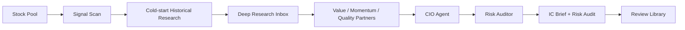

# WorldPay IC / ResearchOS

WorldPay IC is a ResearchOS workspace for equity research teams that need a repeatable Alpha Committee workflow. It turns market anomalies into research tasks, turns deep research into reusable knowledge, and turns committee reports into auditable review records.

The system does not place trades, manage portfolios, or reduce decisions to simple buy/sell calls. Its output focuses on observation, waiting conditions, missing evidence, risk triggers, and reviewable decision logic.

## What It Solves

Most AI research tools stop at a long narrative report. ResearchOS is designed around the actual operating loop after the first answer:

- Detect unusual stock signals and convert them into focused research questions.
- Bootstrap brand-new tickers with 6-12 month historical research prompts before the committee forms a view.
- Route those questions through a Deep Research Inbox before final reporting.
- Compare Value, Momentum, and Quality perspectives instead of relying on one model narrative.
- Produce a polished IC Brief and a separate Risk Audit.
- Preserve decision cases, evidence gaps, and follow-up triggers for later review.
- Show estimated LLM token usage and GPT-5.5-equivalent cost for each recorded run.

## Workflow

The main page is organized as a three-step workflow:

1. Generate research tasks from the selected stock pool.
2. Fill the Deep Research Inbox with external research findings.
3. Rerun the committee chain to generate the final IC Brief and Risk Audit.

The broader operating cycle is:



## Cold-Start Research

When a ticker has no prior filled research in the knowledge store, ResearchOS does not treat the daily price move as enough context. The Research Agent calls a cold-start planner to generate 3-5 Perplexity Deep Research prompts covering the previous 6-12 months.

Cold-start prompts are written as separate pull-request files:

```text
PR-YYYYMMDD-TICKER-COLDSTART-N.yaml
```

They are grouped ahead of daily anomaly prompts in the Deep Research Inbox as historical catch-up work. The expected coverage includes:

- Business model and fundamental changes.
- Industry structure or competitive position.
- Capital-market expectation gaps.
- Regulatory or policy changes when relevant.

Until the cold-start queue is filled or explicitly skipped, the downstream Trading Agents cap confidence at 50% and write the missing historical research into `waiting_conditions`. This keeps new-stock analysis from looking more certain than the evidence supports.

## Core Components

| Component | Role |
| --- | --- |
| Stock Pool | Defines the research universe and watchlist boundaries. |
| Signal Scan | Converts market movement into research tasks instead of instant conclusions. |
| Cold-start Planner | Builds 6-12 month historical research queues for tickers with no prior memory. |
| Deep Research Inbox | Captures external research and stores it as reusable knowledge. |
| Value Partner | Focuses on valuation, cash flow, odds, and margin of safety. |
| Momentum Partner | Focuses on trend, positioning, expectation revisions, and relative strength. |
| Quality Partner | Focuses on moat, execution quality, resilience, and governance. |
| CIO Agent | Synthesizes the committee view into an IC Brief. |
| Risk Auditor | Challenges consensus narratives, evidence gaps, and execution risk. |
| Review Library | Tracks decisions, timelines, outcomes, and monthly learning reviews. |
| LLM Usage Ledger | Estimates input tokens, output tokens, and GPT-5.5-equivalent cost per run. |

## Reports

ResearchOS generates two reader-facing report types:

- **IC Brief**: a committee-ready report covering the anomaly, consensus explanation, non-consensus questions, agent disagreement, waiting conditions, and risk triggers.
- **Risk Audit**: an adversarial review focused on missing evidence, fragile assumptions, reverse scenarios, and follow-up checks.

Reports are rendered as polished HTML reading views. The layout prioritizes summary density first, then full evidence and appendices for auditability.

The guide page includes three sample report formats:

- NVDA anomaly research report
- BABA investment committee decision report
- AMD Risk Auditor report

## Product Surface

The web workspace is organized around user-facing product areas:

- **Task Flow**: the main research workflow from signal scan to final report.
- **Deep Research Inbox**: prompt queue, answer fill-in, and knowledge capture.
- **Report Center**: recent runs, report links, run progress, and LLM token/cost breakdown.
- **Stock Pool**: editable research universe.
- **Review Library**: decision cases, stock timelines, and learning reviews.
- **Usage & Sample Guide**: workflow instructions, cold-start explanation, report examples, and partner-agent explanations.
- **LLM API Settings**: provider and model configuration.

## LLM Cost Visibility

The Report Center includes an `LLM Token Cost` tab for each run. It shows:

- Estimated input tokens.
- Estimated output tokens.
- Total tokens.
- GPT-5.5-equivalent USD cost.
- Per-step breakdown for Partner Agents, CIO Agent, and Risk Auditor.

Historical runs may not include provider-native `usage` fields, so the ledger estimates usage from local `.llm.log` prompt records and generated artifacts. The pricing basis is stored with the result so cost estimates remain auditable.

## Developer Setup

Install dependencies:

```bash
uv sync --extra dev --extra webui
```

Run quality checks:

```bash
uv run ruff check
uv run pytest -q
```

Start the web workspace:

```bash
uv run python webui.py
```

The server prints the local URL when it starts.

## Design Principles

- Research before recommendations.
- Disagreement before synthesis.
- Risk audit before final confidence.
- HTML reports before raw logs.
- Reviewable memory before one-off answers.
- Human decision ownership before automation.

## Boundary

ResearchOS is a research and committee-preparation system. It is not an investment adviser, trading robot, broker integration, or automated order system. Reports are for research, review, and decision preparation only, and do not constitute securities advice.
