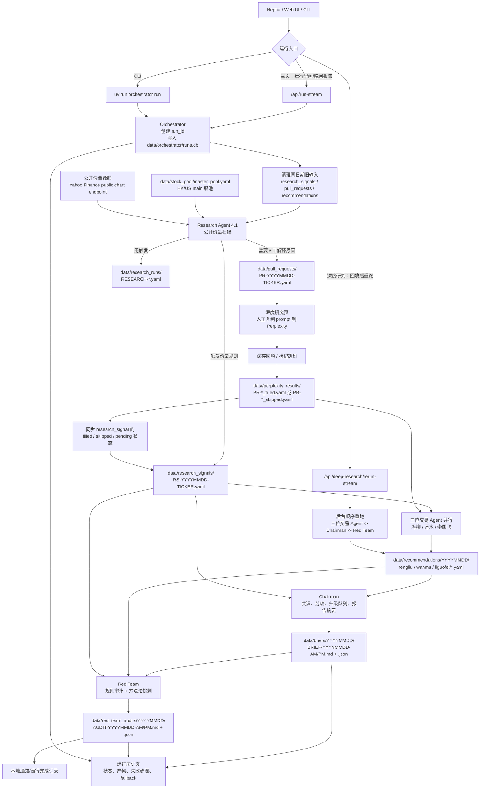
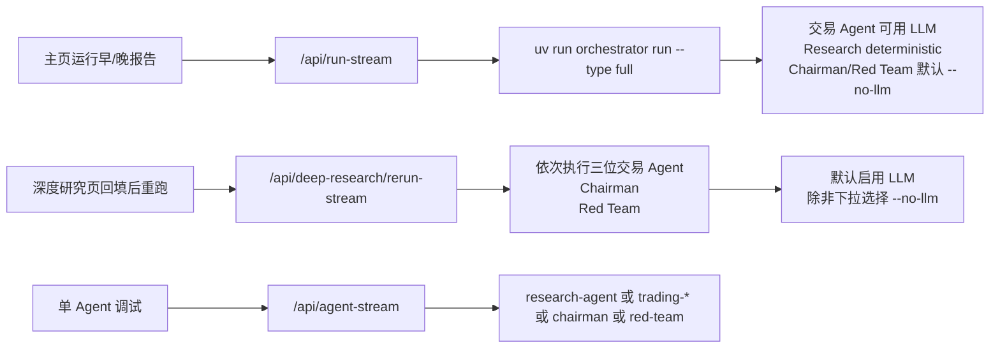
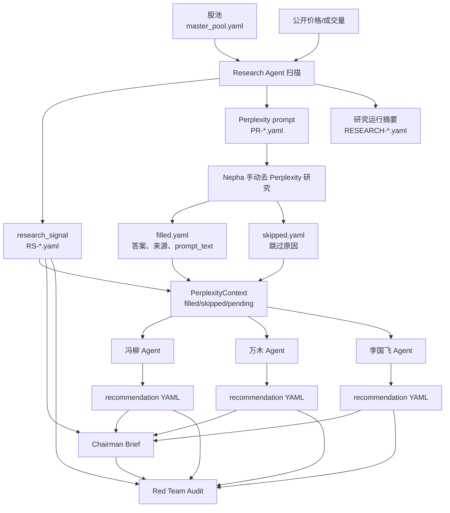
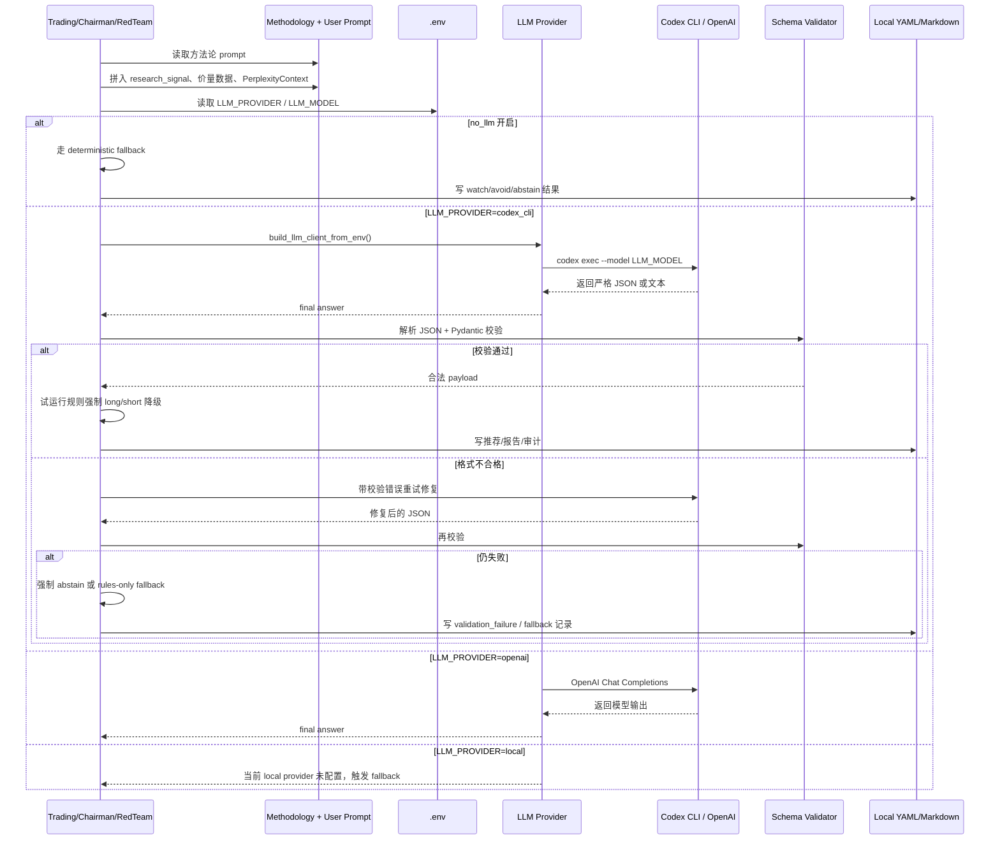
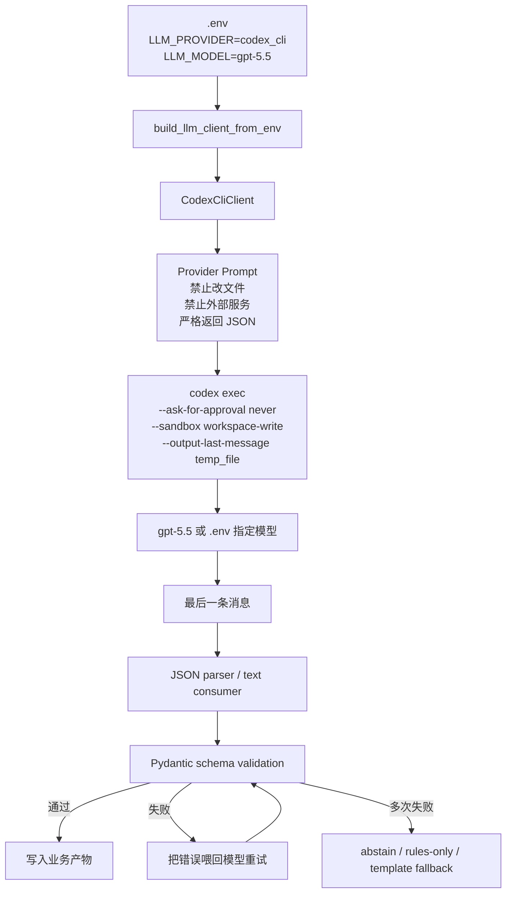
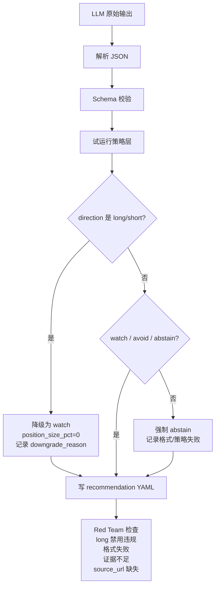
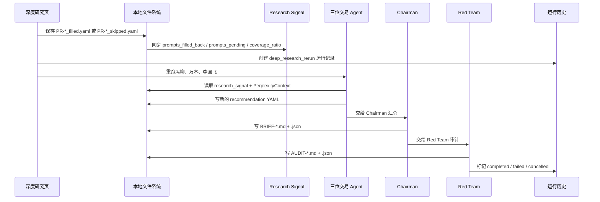

# worldpay77 系统运行流程图

本文按当前代码描述系统如何运行、信息如何流转，以及 LLM 在哪里参与。当前阶段是试运行版：不自动交易，不自动调用 Perplexity，不输出 `long`，交易 Agent 只能输出 `watch / avoid / abstain`。

## 1. 总运行流程

## 2. 运行入口区别

实际影响：

- 主页完整跑适合从零生成当天信号、推荐、Brief、Audit。
- 深度研究回填后重跑适合在 Perplexity 回填后，让三位交易 Agent 重新读取回填内容，再生成新的 Brief/Audit。
- 单 Agent 调试适合排查某一步，不等价于完整系统跑。

## 3. 数据产物流

关键原则：

- Research Agent 只负责发现“值得研究的异常”，不负责交易判断。
- Perplexity 只通过人工回填进入系统，系统不自动联网问 Perplexity。
- Trading Agent 必须引用 4.1 信号和 Perplexity 状态。
- Chairman 汇总分歧，不替 Nepha 做最终交易决策。
- Red Team 做风险和规则审计，不负责给买卖建议。

## 4. LLM 工作机制

LLM 在系统里的职责分工：

- Research Agent：当前主要是 deterministic 价量扫描；会加载方法论 prompt 并记录上下文，但不依赖 LLM 生成信号。
- 三位交易 Agent：可调用 LLM，根据各自方法论解释 4.1 信号、价量证据和 Perplexity 回填；输出必须通过 schema 校验。
- Chairman：可调用 LLM 写分歧叙事；核心共识计算、权重和升级路由仍是 deterministic。
- Red Team：可调用 LLM 做方法论挑刺；硬规则审计 deterministic，LLM 失败时走 rules-only fallback。

## 5. Codex CLI Provider 如何工作

重点限制：

- Codex CLI 在这里被当成“本地 LLM provider”，不是执行 Agent。
- Provider prompt 明确要求不修改文件、不跑迁移、不调用外部服务。
- 交易 Agent 要求 JSON；Chairman/Red Team 可生成文本叙事，但最终仍会落成 Markdown + JSON。
- `CODEX_PROVIDER_REASONING_EFFORT` 默认是 `low`，用于避免一次跑太久。

## 6. 试运行安全闸门

这层是为了避免未校准系统给出真实交易指令。即使 LLM 认为应该买入，第一阶段也只能进入 `watch`。

## 7. 深度研究回填后重跑

回填后重跑主要解决的问题：

- Agent 不能再说“未回填”，因为 `PerplexityContext` 会读取 `filled.yaml`。
- 旧的同日期 recommendation / brief / audit 会在重跑前清理，避免历史产物混在一起。
- 如果浏览器断开，后台任务仍继续跑；历史页用 run_id 查看最终结果。

## 8. 产物路径速查

| 阶段 | 输入 | 输出 |
| --- | --- | --- |
| 股池 | Web UI 股池管理 / `master_pool.yaml` | `data/stock_pool/master_pool.yaml` |
| 4.1 扫描 | 股池 + 公开价量 | `data/research_signals/RS-*.yaml` |
| Perplexity prompt | 触发的 4.1 信号 | `data/pull_requests/PR-*.yaml` |
| 人工回填 | Perplexity 答案或跳过原因 | `data/perplexity_results/PR-*_filled.yaml` / `PR-*_skipped.yaml` |
| 三位交易 Agent | 4.1 信号 + 回填状态 + 方法论 + LLM | `data/recommendations/YYYYMMDD/{fengliu,wanmu,liguofei}/*.yaml` |
| Chairman | recommendations + research_signals | `data/briefs/YYYYMMDD/BRIEF-*.md` + `.json` |
| Red Team | brief + recommendations + research_signals | `data/red_team_audits/YYYYMMDD/AUDIT-*.md` + `.json` |
| 运行历史 | Orchestrator run log + step log | `data/orchestrator/runs.db`、`data/orchestrator/logs/*` |

## 9. 一句话版

系统先用公开价量从股池里筛出异常信号，再把需要解释的原因交给 Nepha 手动 Perplexity 回填；三位交易 Agent 读取信号和回填内容，用各自方法论和 LLM 做保守判断；Chairman 汇总共识与分歧；Red Team 审计规则、证据和格式风险；所有结果都落在本地文件和运行历史里。
